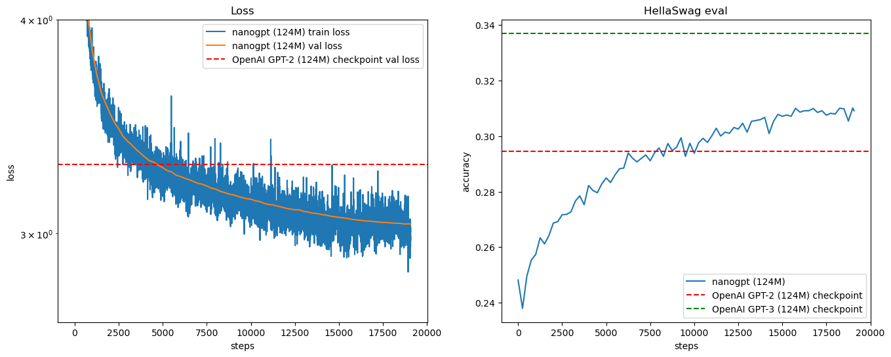

# MINI-GPT2
> Personal repo for follow-along with Andrej Karapathy's nano-GPT2. In this repo I have tried to implement alll corrections from *errata* and also several elements from PR (e.g. shuffling fineweb to avoid periodization issue)

In this repo we build the library [nano-GPT](https://github.com/karpathy/build-nanogpt/tree/master) together with Andrej Karpathy and his video [GPT2 - the movie](https://www.youtube.com/watch?v=l8pRSuU81PU). We managed to replicate the model and gain significatn efficieny improvements during training:


We also adressed several of the issues Andrej had throughout the video including:
1. Seasonality in training data
2. Unable to use `torch.compile` while doing HellaSwag evals in the training loop
3. More aggressive learning rate and schema
4. Enabled resuming training based on last model checkpoint
5. All the issues mentioned in Andrej's Errata in his repo
6. Several other improvements suggested in PRs in Andrej's repo

During training i managed to get a dt of ~ 0.34 per step and processed ~ 1.5M tokens per second. I trained the model for 1 epoch (~10B tokens) in under 2 hrs on 8 A100 (80 GB SXM4) GPUs. This gave me a min training loss of **2.84857**, min validation loss of **3.0383** and a max HellaSwag eval of **0.3101**. Model checkpoints can be provided upon request

**Learn from my mistakes**: download the *fineweb* data and upload it to the cloud (e.g. Google Cloud). You can then download the training data form your cloud when in the GPU cluster instead of running the fineweb script (which can run for up to 1 hr depending on latency / intenet speed). This would have saved me around 15$.


---
## Instructions on setting up lambda cluster
1. Make sure to have your conda env config file (environment.yml) up to date.
2. Initialize a GPU cluster on [Lambda websites](https://cloud.lambdalabs.com/instances) 
3. Hop on a terminal and SSH into the cluster (on Windows):
```bash
ssh -i C:/Users/<USERNAME>/.ssh/LAMBDA_SSH.pem ubuntu@<XXX.XXX.XXX.XXX>
```
4. Clone this repo:
```bash
git clone https://github.com/victorbjorsvik/andrej.git
```
5. Install MiniConda:
```bash
curl -O https://repo.anaconda.com/miniconda/Miniconda3-latest-Linux-x86_64.sh
```
```bash
sh Miniconda3-latest-Linux-x86_64.sh
```
```bash
source ~/.bashrc
```
6. Create the environment:
```bash
conda env create -f environment.yml
```
7. Rock n' Roll

---
## Instructions on setting up Google Cloud CLI (for uploading model states and training data)
[*Link to google cloud storage*](https://console.cloud.google.com/storage/browser)


1. Check that Ubuntu is up to date and has necessary packages:
```bash
sudo apt-get update
```
```bash
sudo apt-get install apt-transport-https ca-certificates gnupg curl
```
2. Import Google Cloud public key:
```bash
curl https://packages.cloud.google.com/apt/doc/apt-key.gpg | sudo gpg --dearmor -o /usr/share/keyrings/cloud.google.gpg
```
3. Add the gcloud CLI distribution URI as a package source
```bash
echo "deb [signed-by=/usr/share/keyrings/cloud.google.gpg] https://packages.cloud.google.com/apt cloud-sdk main" | sudo tee -a /etc/apt/sources.list.d/google-cloud-sdk.list
```
4. Update and install the gcloud CLI:
```bash
sudo apt-get update && sudo apt-get install google-cloud-cli
```
5. Run `gcloud init` to get started
```bash
gcloud init
```
> This step will prompt you to autorize with your google account via browser. Upon verification you will receive a verification code that you can input in the terminal. After this step you will be able to transfer files from your local directory to a google cloud storage destination e.g.:
 ```bash
gcloud storage cp <file_to_transfer> gs://<destination_bucket_name>
```
